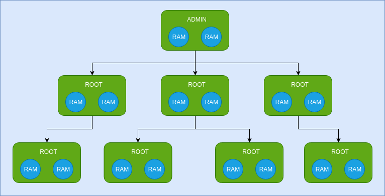

# 简介

臻识科技AI开放平台，是臻识科技基于12年技术积累而提供的云端智能算法平台，其中包括**人脸识别系统**、**车牌识别系统**、**远程运维系统**等多个云系统，第三方开发者可以基于本开放平台提供的API接口开发自己的业务系统，以更好的满足自己的商业需求。

## 接口设计

本开放平台的所有接口均严格按照`RESTful`的规范进行设计，所有的操作均围绕着相关资源进行，以车牌识别为例：

```
POST https://api.vzicloud.com/v2/prs/user/apps/1/plates/detect?accesskey_id=7dh60rSc1115MpXK203FFPDBMmFlMeoQ&expires=1561449423&signature=DbzsxMg3uVrXPJ03aRKQNIApMww%3D HTTP/1.1
Host: www.vzicloud.com
Content-Length: 73878
Content-Type: application/json

{
  "image":"/9j/4AAQSkZJRgABAQEAYABgAAD/2wBDAAUDBAQEAwUEBAQFBQUGBwwIBwc..."
}
```

### HTTP方法

所有接口只采用常用的四种`HTTP`方法，对应`CRUD`操作。

方法 | 含义 | 示例
---|---|---
`GET` | 读取(Read) | `/v2/prs/user/apps/:app_id` *按ID获取当前ROOT用户下的App*
`POST` | 创建(Create) 或者 某些操作类接口 | `/v2/prs/user/apps` *在当前ROOT用户下创建App*
`PUT` | 更新(Update) | `/v2/prs/user/apps/:app_id` *按ID更新当前ROOT用户下的App*
`DELETE` | 删除(Delete) | `/v2/prs/user/apps/:app_id` *按ID删除当前ROOT用户下的App*

### 接口版本

目前提供的所有接口均为`v2`版本。

### 接口模块

我们把所有的接口分别归属于不同的系统下，如下：
- `pms`: 权限管理系统，主要包括用户管理、权限管理、模块管理、接口管理等。
- `frs`: 人脸识别系统，主要包括人脸库管理、人脸检测、人脸对比、人脸搜索等。
- `prs`: 车牌识别系统，主要包括车牌识别。
- `stp`: 远程运维系统，主要包括设备分组、设备管理。

### 接口安全

我们采用`HTTPS`协议保证数据传输的安全性，除此之外，每一个请求都需要使用AccessKey进行签名，以便于服务器对请求进行身份验证，具体签名流程请参考 [用户签名认证](SIGNATURE.md) 章节。

### 错误处理

所有接口如果调用成功，则响应的HTTP状态码为200，并视具体接口而定是否返回数据；反之，响应的HTTP状态为非200（视具体错误而定），并返回如下结构的错误信息：
```
{
  "error_code": 1000,
  "error_message": "Request url is not exist!"
}
```
关于错误码的详细说明请参考 [错误码](ERROR.md) 章节。

### 协议说明

- 所有接口均采用`JSON`作为数据传输协议，字段名称均采用小写字母，单词之间使用`_`分割。
- 传输数据必须采用`UTF-8`进行编码，否侧可能出现乱码现象。

## 账号权限体系

在我们的系统中，用户账号体系是一棵树型结构，如下图：



在这个体系中，我们有以下两种类型的账号：
- **根账号（ROOT）**：图中绿色的圆角矩形框就代表一个ROOT账号，最顶层的ROOT账号我们称之为**超级管理员账号**，其代表的就是臻识科技。每一个公司都有一个ROOT账号，同时也可以为其创建下一级ROOT账号。在权限上，ROOT账号拥有其开通模块的所有接口的调用权，所以一般情况下，ROOT账号由公司最核心人员持有，减少泄露可能性。
- **资源授权账号（RAM）**：由于ROOT账号拥有的权限太大，直接使用ROOT账号是极其危险的，所以可以由ROOT账号的持有者在其下创建若干个RAM账号，用来给公司的技术支持、运维人员或者开发人员使用。RAM账号创建后默认不具备任何权限，需要其ROOT账号为其分配相应的权限方可使用。

前面的内容中，我们提到要完成对接口的访问，需要使用AccessKey进行签名，以便服务器对请求进行身份验证。可以看出，在我们的账号权限体系中，AccessKey是非常重要的，它是接口调用身份认证的钥匙，由`ID`和`Secret`构成，其中`ID`包含了用户信息以及AccessKey的过期时间，可以将其作为账号显示出来，但`Secret`应该作为密码妥善保存，切记不可泄露。我们有如下两种方式来获取AccessKey：
- 通过[账号密码登录](pms/login/LOGIN.md)获取AccessKey，每一个账号（ROOT和RAM）登录成功后，在返回用户信息的同时，会返回一个**临时AccessKey**，之所以说是临时的，是因为这个这个AccessKey的**有效时间只有2小时**，也就是2小时后这个AccessKey将失效而无法使用。为了保证在不重新登录的情况下继续访问接口，可以在**登录成功后的1小时30分钟至2小时**这个窗口期，使用[刷新临时AccessKey](pms/login/REFRESH.md)接口获取一个新的临时AccessKey，旧的AccessKey自动失效，依次类推。
- 由ROOT账号持有者创建一个长期的AccessKey，这个AccessKey的有效期由创建者自由设定，在有效期内可以无障碍使用此AccessKey进行签名，但过了该有效期需要重新更换AccessKey。

以上两种获取AccessKey的方式，开发者可以任选其一，但一定要注意AccessKey的保密问题。

## 